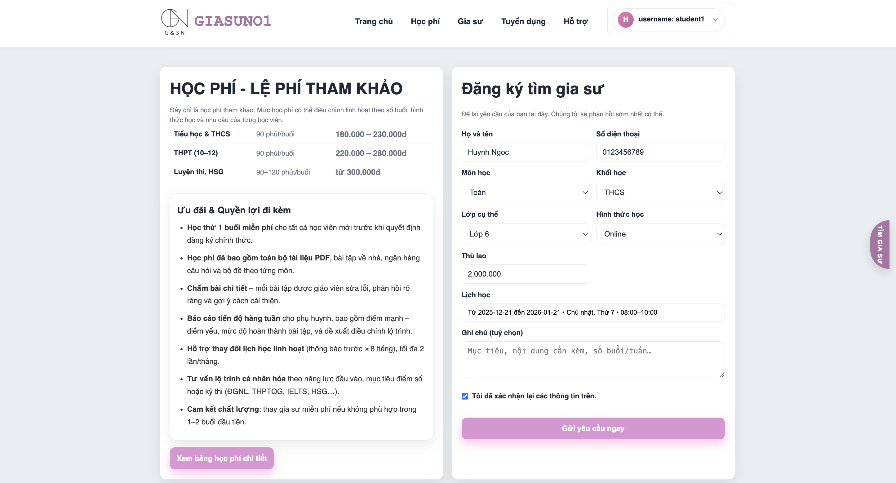
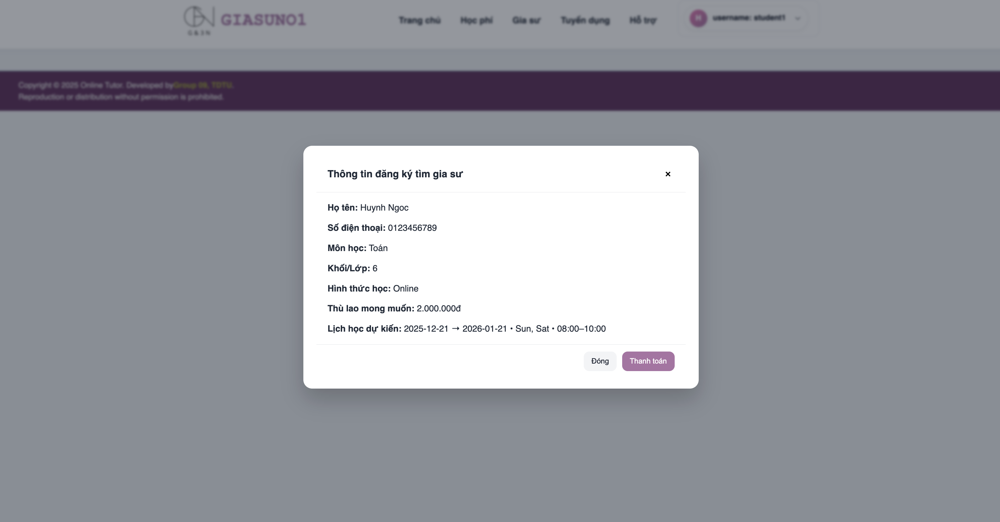
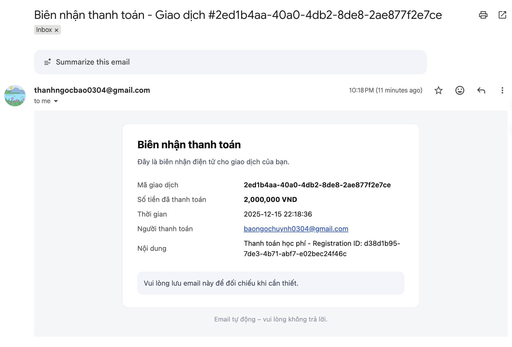
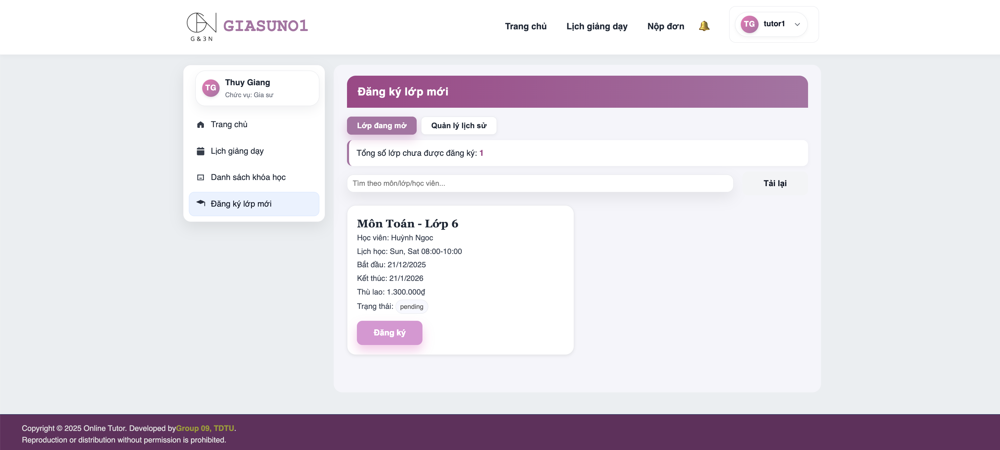
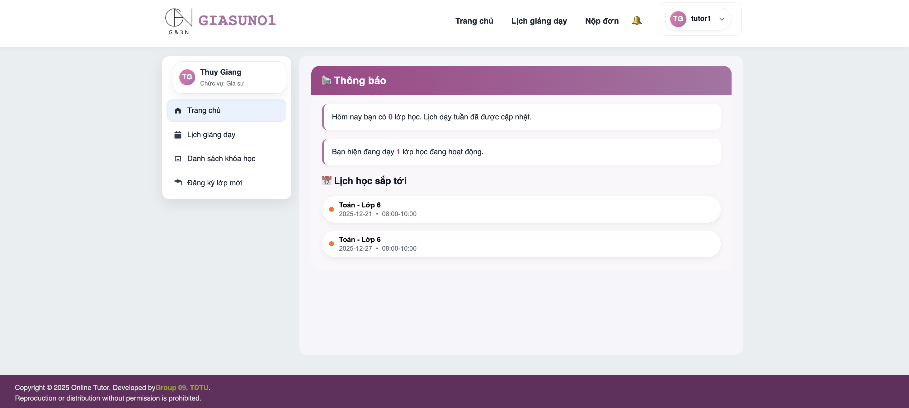
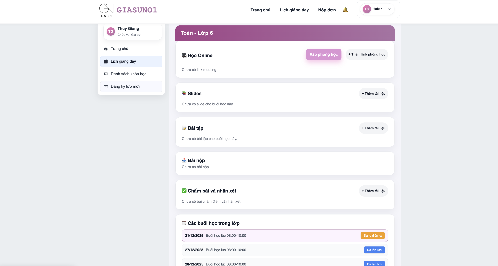

# TutorConnect – Online Tutor Matching and Class Management System

TutorConnect is a comprehensive online education platform designed to connect students with qualified tutors while supporting an interactive and flexible learning environment. Instead of directly selecting a tutor, students submit a tutoring request form specifying detailed information such as grade level, subject, learning schedule, and expected payment.

Tutors can view available class requests, review the provided requirements, and accept suitable requests based on their expertise and availability. Once accepted, tutors can manage assigned classes and participate in the learning process through the platform.

The system integrates essential educational functionalities, including user management, course and class management, e-learning support, and secure payment processing. TutorConnect aims to streamline the tutoring workflow, improve transparency between students and tutors, and enhance the overall learning experience for both parties.

## ✨ Key Features

-   **User Management:** Supports user registration, authentication, and role-based access control for `students` and `tutors`.
-   **Tutor Search & Class Request:** Students can search for tutors based on subjects and submit class requests, which tutors can review and accept.
-   **E-learning Module:** Provides learning materials, progress tracking, and interactive learning features within the platform.
-   **Course & Class Management:** Enables tutors to manage courses, schedules, and enrolled students effectively.
-   **Payment Processing:** Integrates a secure payment service to handle tuition fees and transactions.

## 🎬 Demo

### Student Class Request Form
  
*Students submit tutoring requests by providing subject, grade level, preferred schedule, and expected budget.*

---

### Service Payment & Invoice
  
*Students make payment for the tutor-matching service.*

  
*An electronic invoice is automatically generated and sent to the student’s email after successful payment.*

---

### Tutor Class Selection
  
*Tutors browse available class requests and select suitable classes to teach.*

---

### Tutor Dashboard
  
*Tutors manage accepted classes, track teaching schedules, and monitor their activities.*

---

### E-learning System
  
*Integrated e-learning interface supporting online lessons and learning materials.*


## 🛠️ Tech Stack

### Backend

- **Language**: Python
- **Framework**: FastAPI
- **Architecture**: Microservices
- **Database**: Supabase
- **Components**:
    - **Gateway**: `localhost:8000` - The main entry point for the API, directing requests to the corresponding microservices.
    - **Authentication Service**: `localhost:8001` - Handles authentication, login, and registration.
    - **User Service**: `localhost:8002` - Manages user information.
    - **Academic Service**: `localhost:8003` - Manages academic matters like courses and tutors.
    - **Learning Service**: `localhost:8004` - Supports functions related to the learning process.
    - **Payment Service**: `localhost:8005` - Processes payment transactions.

### Frontend

- **Language**: JavaScript
- **Framework**: React (using Vite)
- **Libraries**:
    - `axios`: For sending HTTP requests to the backend.
    - `react-router-dom`: For managing page navigation.
- **Interface**: A modern user interface built with React components.

### Containerization

- **Technology**: Docker
- **Orchestration**: Docker Compose

## 🚀 Quickstart

This project is configured to run seamlessly using Docker and Docker Compose. This is the recommended way to get all services up and running.

### Prerequisites

-   [Docker](https://www.docker.com/get-started/)
-   [Docker Compose](https://docs.docker.com/compose/install/)

### Steps

1.  **Create Environment File**

    In the root directory of the project, create a file named `.env`. This file will hold all the necessary environment variables for the backend services. Copy the contents of the example below into your `.env` file and replace the placeholder values with your actual credentials.

    ```env
    # /<project-root>/.env

    # Supabase config
    SUPABASE_URL="YOUR_SUPABASE_URL"
    SUPABASE_SERVICE_ROLE_KEY="YOUR_SUPABASE_KEY"

    # JWT config
    JWT_SECRET="your-very-secret-jwt-key-that-is-long-and-secure"
    JWT_ALGORITHM="HS256"
    JWT_EXPIRE_MINUTES="60"

    # SMTP config for sending emails
    MAIL_FROM="your-email@example.com"
    SMTP_HOST="smtp.gmail.com"
    SMTP_PORT="587"
    SMTP_USER="your-gmail-username"
    SMTP_PASS="your-gmail-app-password"

    # Service endpoints (for Docker Compose, use the service names as hostnames)
    AUTH_SVC_URL="http://auth:8001"
    USER_SVC_URL="http://users:8002"
    ACADEMIC_SVC_URL="http://academic:8003"
    LEARNING_SVC_URL="http://learning:8004"
    PAYMENT_SVC_URL="http://payment:8005"
    ```

2.  **Build and Run the Services**

    Open your terminal in the root directory and run the following command. This will build the Docker images for the frontend and backend services and start them in the background.

    ```bash
    docker-compose up -d --build
    ```

3.  **Access the Application**

    Once the containers are running, you can access the different parts of the system:
    -   **Frontend Application**: [http://localhost:8080](http://localhost:8080)
    -   **API Gateway (Swagger UI)**: [http://localhost:8000/docs](http://localhost:8000/docs)

4.  **Stopping the Application**

    To stop all running services, use the following command:

    ```bash
    docker-compose down
    ```

## 🏗️ System Architecture

- **Backend**: Follows a microservices architecture where each service handles a specific function and communicates through an API Gateway. This makes the system flexible, scalable, and easy to maintain.
- **Frontend**: A Single Page Application (SPA) built with React. The frontend communicates with the backend via the API Gateway.
